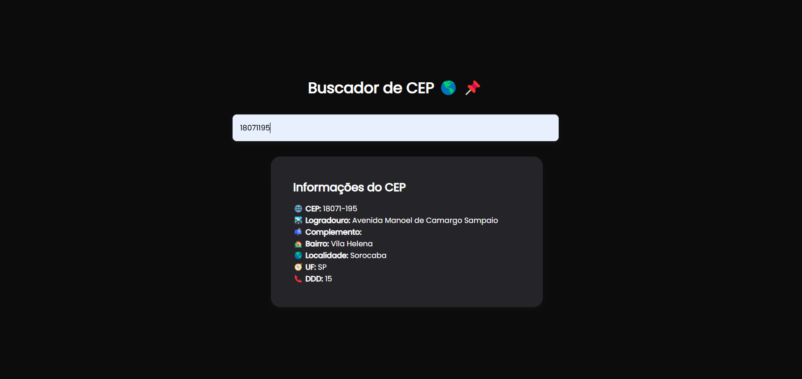

# Buscador de CEP

Projeto básico com foco em fixar os aprendizados adquiridos durante o curso Santander Tech+ e para manter a pratica em dia, pois apenas praticando é que se aprende!

## Aprendizados

O que você aprendeu construindo esse projeto? Quais desafios você enfrentou e como você superou-os?

Neste projeto pude aprender mais sobre APIs, tipos de API, programação Assincrona, consumo de APIs, uso de JSON, Fecth API e muito mais.

## Screenshots

## 🚀 Tecnologias

**HTML, CSS e Javascript**
